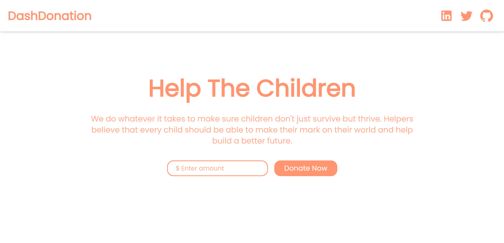

<h1 align="center" style="color: red; font-size: 40px"> Dash Donation </h1>
<h2  align="center">Public Donation for a Charity Oranization -  </h2> 

## 🔗[Live Demo](https://dash-donation.vercel.app) 




<br>


# Installation

 ### Install server dependencies
 ``` cd dash_donation 
     npm install
 ```
 ### Install client dependencies
 ```
     cd client 
     npm install
     npm run build
 ```
 
 ### Serving the application 
 - Go back to the root folder
  ```
    npm run dev
  ```
  - The app will start listening on port ```5200```
  - Go to ```localhost:5200```
 
 ## Payment Gateway

- [Chapa](https://developer.chapa.co/)
 
